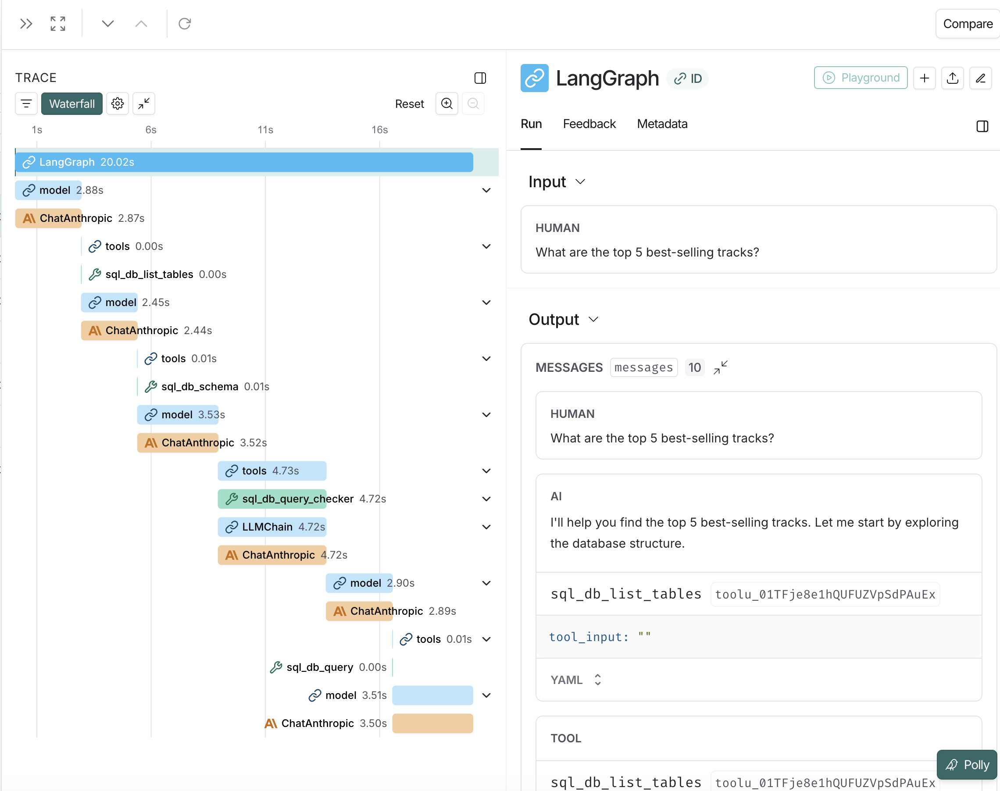

# Text-to-SQL Agent

A natural language to SQL query agent powered by LangChain. Ask questions about your database in plain English and get accurate SQL queries and results.

## Features

- Natural language to SQL query conversion
- Automatic query validation and error correction
- Support for complex queries (JOINs, aggregations, subqueries)
- LangSmith integration for tracing and debugging
- Interactive tutorial notebook included

## Demo Database

Uses the [Chinook database](https://github.com/lerocha/chinook-database) - a sample database representing a digital media store with tables for artists, albums, tracks, customers, invoices, and more.

## Quick Start

### Prerequisites

- Python 3.11 or higher
- Anthropic API key ([get one here](https://console.anthropic.com/)) (Or you can use a different model provider)
- (Optional) LangSmith API key for tracing ([sign up here](https://smith.langchain.com/))

### Installation

1. Clone the repository:
```bash
git clone https://github.com/kevinbfrank/text-to-sql-agent.git
cd text-to-sql-agent
```

2. Download the Chinook database:
```bash
# Download the SQLite database file
curl -L -o chinook.db https://github.com/lerocha/chinook-database/raw/master/ChinookDatabase/DataSources/Chinook_Sqlite.sqlite
```

3. Create a virtual environment and install dependencies:
```bash
# Using uv (recommended)
uv venv --python 3.11
source .venv/bin/activate  # On Windows: .venv\Scripts\activate
uv pip install -e .

# Or using standard pip
python3.11 -m venv .venv
source .venv/bin/activate
pip install -e .
```

4. Set up your environment variables:
```bash
cp .env.example .env
# Edit .env and add your API keys
```

Required in `.env`:
```
ANTHROPIC_API_KEY=your_anthropic_api_key_here
```

Optional for LangSmith tracing:
```
LANGCHAIN_TRACING_V2=true
LANGSMITH_ENDPOINT=https://api.smith.langchain.com
LANGCHAIN_API_KEY=your_langsmith_api_key_here
LANGCHAIN_PROJECT=text2sql-agent
```

## Usage

### Command Line Interface

Run the agent from the command line with a natural language question:

```bash
python agent.py "What are the top 5 best-selling artists?"
```

```bash
python agent.py "Which employee generated the most revenue?"
```

```bash
python agent.py "How many customers are from Canada?"
```

### Interactive Tutorial

Explore the agent capabilities with the included Jupyter notebook:

```bash
jupyter notebook tutorial.ipynb
```

The tutorial includes:
- Step-by-step agent construction
- Example queries
- LangSmith tracing setup
- Database schema reference

## How It Works

The agent uses LangChain's `create_agent` with the following workflow:

1. **Discover** - Lists available tables in the database
2. **Inspect** - Retrieves schema for relevant tables (with sample rows)
3. **Generate** - Creates a SQL query using Claude Sonnet 4.5
4. **Validate** - Double-checks the query for syntax and safety
5. **Execute** - Runs the query against the database
6. **Retry** - If errors occur, automatically rewrites and retries
7. **Format** - Returns results in a readable format

## LangSmith Integration

When configured, every query is automatically traced in LangSmith. You can view:
- Complete execution trace with all tool calls
- Token usage and costs
- Query execution time
- Generated SQL queries
- Error messages and retry attempts



View traces at: https://smith.langchain.com/

## Configuration

Key configuration options in `agent.py`:

```python
# Limit sample rows shown in schema
db = SQLDatabase.from_uri(
    "sqlite:///chinook.db",
    sample_rows_in_table_info=3  # Adjust as needed
)

# Default result limit (in system prompt)
system_prompt=SYSTEM_PROMPT.format(
    dialect=db.dialect,
    top_k=5  # Adjust as needed
)
```

## Project Structure

```
text2sqlagent/
├── agent.py              # Core agent implementation
├── tutorial.ipynb        # Jupyter tutorial notebook
├── chinook.db           # Sample SQLite database (gitignored)
├── pyproject.toml       # Project configuration and dependencies
├── uv.lock              # Locked dependency versions
├── .env.example         # Environment variable template
├── .gitignore           # Git ignore rules
└── README.md            # This file
```

## Requirements

All dependencies are specified in `pyproject.toml`:

- langchain >= 1.2.3
- langchain-anthropic >= 1.3.1
- langchain-community >= 0.3.0
- langgraph >= 1.0.6
- sqlalchemy >= 2.0.0
- python-dotenv >= 1.0.0
- rich >= 13.0.0

## License

MIT

## Acknowledgments

- Built with [LangChain](https://www.langchain.com/)
- Uses the [Chinook Database](https://github.com/lerocha/chinook-database)
- Tracing via [LangSmith](https://smith.langchain.com/)

## Contributing

Contributions are welcome! Please feel free to submit a Pull Request.
